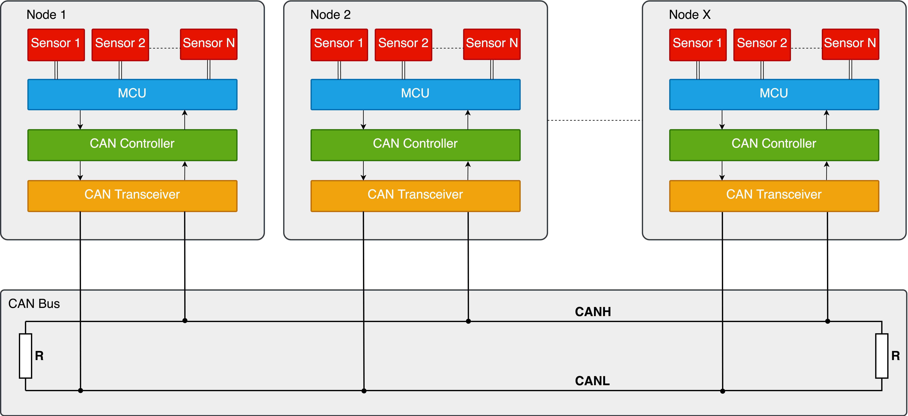

## About

**SNODE** (Sensor Node) – is an open source library that allows to make it easy to build a multi-master serial bus network for hot-plugging nodes with sensors.

Communication between nodes is done over the CAN (Controller Area Network) bus. The CAN bus is a communications protocol which has been around for years as a vehicle bus standard designed to allow nodes to communicate with each other without the need for a host.

In an implementation of SNODE each node could have a few sensors. Each sensor of the node is able to send and receive messages to/from the other sensors of nodes over the CAN bus. This means that a node can have several sensors, each of which can be a master or a slave (the sensor mode type is input or output).

Using the SNODE library simplifies the development process, enabling you to build connected devices in minutes and bring your idea to life.

